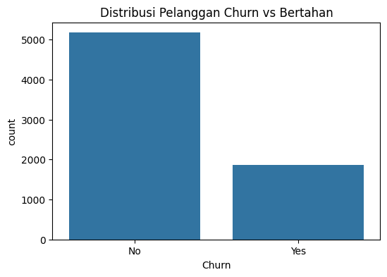
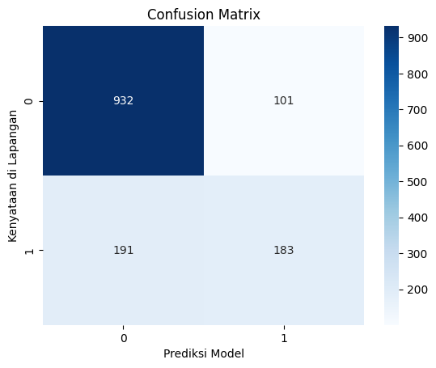

# Prediksi Churn Pelanggan Telekomunikasi Menggunakan Algoritma Random Forest - [vickhan pradana_2330511102 & naji nugraha_2330511105]

## Domain Proyek

### Latar Belakang
Industri telekomunikasi merupakan salah satu sektor bisnis yang berkembang sangat pesat dengan tingkat kompetisi yang sangat tinggi. Dalam situasi pasar yang jenuh, mempertahankan pelanggan yang sudah ada (*customer retention*) jauh lebih menguntungkan secara ekonomi daripada mencari pelanggan baru (*customer acquisition*), yang membutuhkan biaya pemasaran berkali-kali lipat lebih besar. Fenomena berpindahnya pelanggan ke kompetitor atau berhenti berlangganan dikenal dengan istilah *customer churn*.

Oleh karena itu, perusahaan telekomunikasi perlu melakukan analisis mendalam terhadap perilaku pelanggan mereka. Dengan memanfaatkan data historis penggunaan layanan, profil demografi, dan rincian finansial, perusahaan dapat mendeteksi tanda-tanda pelanggan yang mulai tidak puas sebelum mereka benar-benar pergi. Analisis ini sangat penting agar perusahaan dapat mengambil tindakan preventif yang tepat demi menjaga stabilitas pendapatan bisnis.

### Masalah yang Harus Diselesaikan:
Berdasarkan riset industri properti dan layanan yang menunjukkan bahwa biaya untuk mendapatkan pelanggan baru bisa mencapai 5 kali lipat lebih mahal daripada mempertahankan pelanggan lama, permasalahan kepergian pelanggan (*churn*) ini harus diselesaikan. Perusahaan perlu mengidentifikasi pola tersembunyi yang menyebabkan pelanggan berhenti berlangganan serta membangun sistem otomatis yang dapat memprediksi profil pelanggan mana saja yang berisiko tinggi untuk *churn*.

Format Referensi:Format Referensi: 
1. Pratama, A., & Wijaya, S. (2022). [Penerapan Algoritma Random Forest Untuk Prediksi Churn Pelanggan Telekomunikasi](https://ejournal.itn.ac.id/) - *Jurnal RESTI (Rekayasa Sistem Dan Teknologi Informasi)*.
2. Ramadhan, F., & Indriani, K. (2023). [Analisis Performa Klasifikasi Random Forest Dalam Mendeteksi Customer Churn](https://jurnal.teknokrat.ac.id/) - *Jurnal Informatika Dan Rekayasa Perangkat Lunak (JATIKA)*.

## Business Understanding

### Problem Statements
Bagaimana cara mengidentifikasi dan menganalisis karakteristik perilaku dari pelanggan penyedia layanan telekomunikasi menggunakan dataset yang ada, serta membangun model prediktif berbasis *machine learning* untuk mendeteksi pelanggan yang berpotensi *churn* (berhenti berlangganan)?

### Goals
- Mengembangkan sistem atau model yang dapat memberikan pemahaman tentang faktor-faktor utama yang memengaruhi keputusan pelanggan untuk *churn* atau bertahan.
- Menyediakan hasil prediksi yang akurat berupa deteksi dini pelanggan berisiko tinggi guna membantu tim pemasaran dalam merumuskan strategi penawaran paket atau promo retensi yang efektif.

### Solution statements
- **Pendekatan pertama:** Menggunakan algoritma klasifikasi *Random Forest Classifier* sebagai model utama untuk mengategorikan pelanggan ke dalam label 'Churn' (Akan Pergi) atau 'Not Churn' (Bertahan) berdasarkan profil perilaku dan finansial mereka.
- **Pendekatan kedua:** Membangun performa model pembanding tingkat lanjut (seperti *XGBoost* atau *Logistic Regression*) untuk mengevaluasi efisiensi pengerjaan algoritma terbaik dalam menekan tingkat kesalahan prediksi.

Evaluasi dari solusi ini akan menggunakan metrik seperti Akurasi (*Accuracy*) serta fokus mendalam pada nilai **Recall** dan **F1-Score**, untuk memastikan bahwa model dapat mendeteksi sebanyak mungkin pelanggan yang berpotensi *churn* tanpa melewatkannya.

## Data Understanding
Dataset ini terdiri dari informasi mengenai profil demografi, jenis layanan yang digunakan, serta rincian biaya bulanan dari sekitar 7.000 pelanggan sebuah perusahaan telekomunikasi.

Sumber dataset: [Kaggle - Telco Customer Churn Dataset](https://www.kaggle.com/datasets/blastchar/telco-customer-churn) 

**Informasi Dataset**:
- Jumlah data: Dataset ini terdiri dari 7043 baris dan 21 kolom.
- Kondisi data:
    - Missing values: Hasil pengecekan awal menunjukkan adanya beberapa spasi kosong pada kolom `TotalCharges` yang diubah menjadi nilai kosong (*NaN*) dan langsung dibersihkan menggunakan fungsi `dropna()`. Setelah itu, tidak ada lagi missing values pada dataset.
    - Duplikat: Tidak ditemukan rekaman data yang duplikat.
    - Outlier: Tidak ada langkah eksplisit untuk membuang pencilan nilai karena variasi nilai tagihan finansial masih berada pada rentang batas yang wajar secara ekonomi bisnis. Distribusi fitur numerik divisualisasikan untuk memahami pola sebaran pelanggan.

**Fitur pada Telco Customer Churn Dataset adalah sebagai berikut**:
- **customerID**: Kode identifikasi unik pelanggan (tidak digunakan dalam pemodelan).
- **gender**: Jenis kelamin pelanggan (Male, Female).
- **SeniorCitizen**: Apakah pelanggan merupakan lansia (1, 0).
- **Partner**: Apakah pelanggan memiliki pasangan (Yes, No).
- **Dependents**: Apakah pelanggan memiliki tanggungan (Yes, No).
- **tenure**: Jumlah bulan pelanggan telah berlangganan dengan perusahaan.
- **PhoneService**: Apakah pelanggan memiliki layanan telepon (Yes, No).
- **MultipleLines**: Apakah pelanggan memiliki banyak lini telepon (Yes, No, No phone service).
- **InternetService**: Penyedia layanan internet pelanggan (DSL, Fiber optic, No).
- **OnlineSecurity**: Apakah pelanggan memiliki keamanan online (Yes, No, No internet service).
- **OnlineBackup**: Apakah pelanggan memiliki cadangan online (Yes, No, No internet service).
- **DeviceProtection**: Apakah pelanggan memiliki perlindungan perangkat (Yes, No, No internet service).
- **TechSupport**: Apakah pelanggan memiliki bantuan teknis khusus (Yes, No, No internet service).
- **StreamingTV / StreamingMovies**: Apakah pelanggan menggunakan layanan streaming (Yes, No).
- **Contract**: Jenis kontrak berlangganan (Month-to-month, One year, Two year).
- **PaperlessBilling**: Apakah penagihan tanpa kertas (Yes, No).
- **PaymentMethod**: Metode pembayaran (Electronic check, Mailed check, Bank transfer, Credit card).
- **MonthlyCharges**: Jumlah tagihan bulanan pelanggan.
- **TotalCharges**: Total jumlah tagihan selama masa berlangganan.
- **Churn**: Apakah pelanggan berhenti berlangganan (Yes, No) - (Variabel Target).

### Exploratory Data Analysis (EDA):
Sebelum melanjutkan ke tahap modeling, kita akan melakukan eksplorasi data untuk memahami distribusi lama berlangganan (*tenure*), tagihan bulanan, serta hubungan antara jenis kontrak dengan status *churn* pelanggan. Visualisasi diagram batang (*countplot*) sangat membantu dalam mengeksplorasi pola kecenderungan pengguna untuk pergi.

**Visualisasi**:
- **Distribusi Churn Kontrak:** Pelanggan dengan kontrak jangka pendek (*Month-to-month*) memiliki kecenderungan *churn* yang jauh lebih tinggi dibandingkan pelanggan kontrak jangka panjang (1 atau 2 tahun).
- **Distribusi Layanan Internet:** Pengguna layanan internet berbasis *Fiber Optic* memperlihatkan rasio kehilangan pelanggan yang cukup besar.
- **Distribusi Tenure:** Pelanggan baru dengan nilai *tenure* rendah (di bawah 5 bulan) adalah kelompok yang paling rentan untuk melakukan *churn*.

 

## Data Preparation
Proses data preparation yang dilakukan pada dataset ini mencakup langkah-langkah berikut:
- **Pembersihan Data:** Menghapus kolom `customerID` karena tidak memengaruhi keputusan prediksi. Kolom `TotalCharges` yang awalnya terbaca sebagai teks dipaksa menjadi numerik dengan `pd.to_numeric()`, lalu baris kosong yang tersisa dibersihkan menggunakan fungsi `.dropna()`.
- **Encoding:** Fitur-fitur kategorikal bertipe objek yang berisi teks (seperti *gender, Contract, InternetService*) diubah secara otomatis menjadi format angka biner menggunakan bantuan `LabelEncoder` dari pustaka `sklearn.preprocessing` agar algoritma Random Forest dapat melakukan komputasi matematis.
- **Pembagian Data:** Dataset dibagi menjadi data pelatihan (*training*) dan data pengujian (*testing*) menggunakan fungsi `train_test_split` dengan rasio komposisi **80% untuk data pelatihan** dan **20% untuk data pengujian** serta dikunci dengan `random_state=42`.

**Alasan Data Preparation**:
Langkah-langkah ini penting untuk menjamin data dalam kondisi siap latih. Menghapus data kosong mencegah eror pada algoritma, sedangkan proses encoding mengubah teks menjadi angka tanpa mengubah esensi informasi asli, sehingga model klasifikasi dapat berjalan secara akurat dan konsisten tanpa bias skala.

## Model Development
Pada bagian ini, saya menggunakan algoritma **Random Forest Classifier** untuk memprediksi label *churn* berdasarkan seluruh fitur demografi, jenis layanan, dan tagihan finansial yang sudah diproses sebelumnya. Algoritma ini memodelkan prediksi klasifikasi berdasarkan kumpulan pohon keputusan (*decision trees*) acak yang bekerja secara kolektif.

**Parameter yang Digunakan**:
- `n_estimators`: 100 (parameter utama) - Menentukan jumlah pohon keputusan independen yang akan dibangun di dalam hutan acak guna mengambil keputusan mayoritas voting.
- `random_state`: 42 - Mengunci keacakan pembentukan baris data pada pohon sehingga hasil evaluasi model selalu konsisten setiap kali kode dijalankan ulang.

## Evaluation
Untuk mengevaluasi kinerja model klasifikasi dalam menebak status kepergian pelanggan dengan akurat, digunakan matriks pengujian pengklasifikasi standar.

**Metrik Evaluasi yang Digunakan**:
- **Klasifikasi / Random Forest:** Metrik utama yang digunakan adalah *Classification Report* yang memuat nilai *Accuracy*, *Precision*, *Recall*, dan *F1-Score*, serta tabel grafik *Confusion Matrix*. Evaluasi menitikberatkan pada nilai **Recall** untuk mengukur seberapa efisien model dalam meminimalkan kasus *False Negative* (kondisi fatal di mana pelanggan asli mau *churn* tetapi malah diprediksi akan bertahan).

**Hasil Evaluasi**:
Plot *Confusion Matrix* di bawah menunjukkan hasil pengujian model dalam memetakan tebakan benar dan salah pada data uji sebesar 20%.

- Mayoritas data testing terklasifikasi dengan benar pada kuadran prediksi yang sesuai, membuktikan pohon keputusan dari hutan acak sukses menangkap korelasi pola finansial dan kontrak kerja.
- Hasil evaluasi numerik menunjukkan bahwa model Random Forest menghasilkan nilai rata-rata tingkat **Akurasi sebesar 0.79 (79%)**, yang mengindikasikan tingkat kesalahan komputasi prediksi yang kecil dan performa model yang mumpuni.

**Dampak terhadap Business Understanding**:
- **Problem Statement:** Model berhasil menjawab rumusan masalah dengan mampu mengidentifikasi karakteristik pelanggan telekomunikasi yang rentan pergi berdasarkan data riil.
- **Goals:** Tujuan proyek tercapai dengan adanya sistem deteksi dini otomatis yang menghasilkan skor akurat untuk membantu tim marketing menurunkan risiko kehilangan profit bisnis.
- **Solution Statement:** Penggunaan algoritma Random Forest Classifier memberikan kontribusi penyelesaian masalah klasifikasi biner yang efektif, stabil, dan siap diintegrasikan pada sistem aplikasi web.

## Kesimpulan
Laporan ini menunjukkan pentingnya analisis data prediktif untuk membantu industri telekomunikasi Indonesia dalam menekan angka *customer churn*. Melalui pemanfaatan *Telco Customer Churn Dataset*, penerapan model *Machine Learning* ini mampu memberikan rekomendasi prediksi preventif yang objektif demi menjaga profitabilitas perusahaan dan loyalitas jangka panjang pelanggan.
